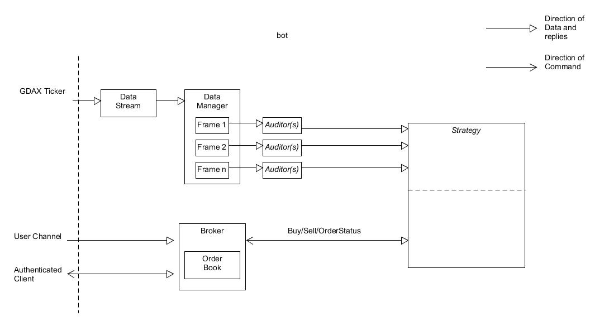

<h2> Capital	-	07-20-2018	-	Paul Leimer </h2>
<b>Abstract</b> 

Capital is a GDAX trading framework that allows for the implementation of trading strategies. The goal is to enable
easy implmentation of robust, complex trading strategies.
Capital is built such that it is simple to incorporate new tools for creating strategies and provides an interface
to monitor a strategy's performance.

A simulator is built in allowing for the testing of strategies in a no stakes environment with real or generated data.
It can be run in real time or processor time (fast).

 
 
<b> The Plan </b>
 
 

 When creating a trading strategy that a bot can run, there are a few things a
designer might need: 

<ul>
	<li>A way to to see past data and trends on multiple products at once</li>
	<li>A way to make observations and calculations on that data</li>
	<li>A way to execute buys and sells based on those calculations and on previous transaction history</li>
	<li>A way to see the results</li>
</ul>

The overarching goal of this framework is to provide a platform on which one could create extremely customizable, complex
strategies as easily as possible. Even more, if the tools to implement a strategy within the framework do not already exist,
it should be easy for a strategist to create his own tools and implement them himself with the resources provided. Lastly, 
the framework should provide a simulation environment to test strategies in. 

 
 
<b> Architecture </b>
 
 

 <i>Italicized Classes</i> are abstract and must be inherited from

<i>Data Stream</i>: inteface for obtaining live ticker data from the GDAX api. When new data arrives, DataStream dumps it
into a queue from which tha DataManager gets the data. This module can be simulated to pump data through the rest of the structure
for testing purposes. 

<i>Data Manager</i>: intermediary between incoming data and api's that process that data. The DataManager class analyzes data
from the DataStream queue and writes the data to a selection of frames.  

<i>Frame</i>: a container encapsulating a specified timedelta of information. Data injected into a frame by the DataManager is
trimmed down to data exclusive to the time between now() minus the frame length. Frames serve as the middleman between
the DataManager and Auditor modules.
 

<i>Auditor</i>: abstract class responsible for watching for updates in the frames and and running calculations and other processes 
on those frames. Auditors are the tools that Strategies (see below) use to decide on buying and selling. Classes that wish to process
data in a frame must inherit from this class and override the process() method. The parent class runs the process() method upon the reception
of new data in the frame attached to it. An example of an auditor would be a statistics class 
that calculates new statistics on the data within a frame whenever new new data arrives. 
 

<i>Strategy</i>: abstract class in which all buying and selling logic takes place. A new strategy must inherit from this class and 
override the setup() and strategy() function. A strategy uses the auditor tools to monitor product trends. It also incorporate 
transaction status information (obtained from the broker) as well as account information in it's trading logic. When it is ready to 
place an order, a strategy asks the broker (below) to place and track that order in the exchange.

<i>Broker</i>: the broker is responsible for interfacing with a user's private account. It sends transaction requests to the 
exchange, monitors the status of those transations in an order book, and sends order status updates to the strategy objects. It
must take care to stay synched with the exchange and minimize rounding errors that could disrupt trading logic.

